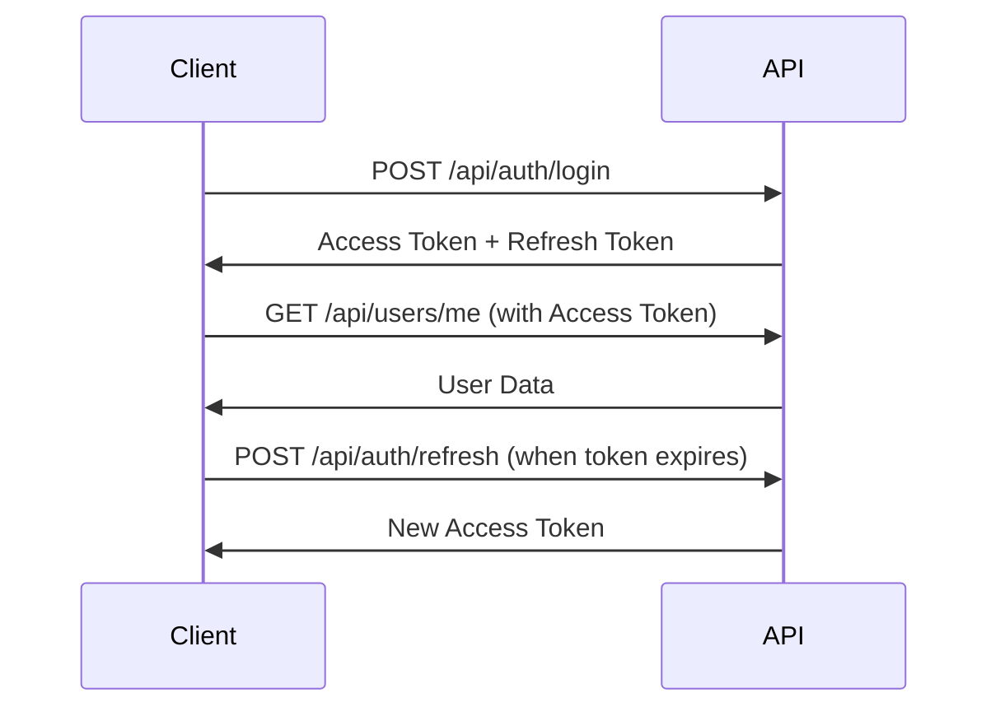

# SpherosegV4 API Documentation

This document provides comprehensive API documentation for all SpherosegV4 services, including request/response formats, authentication, and usage examples.

## Table of Contents

1. [Overview](#overview)
2. [Authentication](#authentication)
3. [Common Headers](#common-headers)
4. [Error Handling](#error-handling)
5. [Rate Limiting](#rate-limiting)
6. [API Endpoints](#api-endpoints)
   - [Authentication](#authentication-endpoints)
   - [Users](#user-endpoints)
   - [Images](#image-endpoints)
   - [Segmentation](#segmentation-endpoints)
   - [Projects](#project-endpoints)
   - [Admin](#admin-endpoints)
7. [WebSocket Events](#websocket-events)
8. [ML Service API](#ml-service-api)
9. [Response Formats](#response-formats)
10. [Code Examples](#code-examples)

## Overview

The SpherosegV4 API is a RESTful API that provides programmatic access to all application features. The API follows REST conventions and returns JSON responses.

### Base URLs

```
Production: https://api.your-domain.com
Development: http://localhost:5001
ML Service: http://localhost:5002 (internal only)
```

### API Versioning

Currently, the API is at version 1. All endpoints are prefixed with `/api`.

## Authentication

SpherosegV4 uses JWT (JSON Web Tokens) for authentication with refresh token rotation.

### Authentication Flow



### Token Details

**Access Token**:
- Expiration: 15 minutes
- Type: Bearer token
- Storage: Memory (recommended) or sessionStorage

**Refresh Token**:
- Expiration: 7 days
- Type: HTTP-only cookie
- Storage: Secure cookie with SameSite

## Common Headers

### Request Headers

```http
Authorization: Bearer <access_token>
Content-Type: application/json
Accept: application/json
X-Request-ID: <uuid> (optional, for request tracking)
```

### Response Headers

```http
Content-Type: application/json
X-Request-ID: <uuid>
X-RateLimit-Limit: 100
X-RateLimit-Remaining: 99
X-RateLimit-Reset: 1625097600
```

## Error Handling

### Error Response Format

```json
{
  "error": {
    "code": "VALIDATION_ERROR",
    "message": "Validation failed",
    "details": [
      {
        "field": "email",
        "message": "Invalid email format"
      }
    ],
    "timestamp": "2024-01-10T12:00:00Z",
    "requestId": "550e8400-e29b-41d4-a716-446655440000"
  }
}
```

### Common Error Codes

| Status Code | Error Code | Description |
|-------------|------------|-------------|
| 400 | VALIDATION_ERROR | Invalid request parameters |
| 401 | UNAUTHORIZED | Missing or invalid authentication |
| 403 | FORBIDDEN | Insufficient permissions |
| 404 | NOT_FOUND | Resource not found |
| 409 | CONFLICT | Resource conflict (e.g., duplicate email) |
| 429 | RATE_LIMIT_EXCEEDED | Too many requests |
| 500 | INTERNAL_ERROR | Server error |

## Rate Limiting

### Rate Limit Rules

| Endpoint Type | Limit | Window |
|--------------|-------|---------|
| Authentication | 5 requests | 15 minutes |
| API (authenticated) | 100 requests | 15 minutes |
| API (public) | 20 requests | 15 minutes |
| File upload | 10 requests | 1 hour |

### Rate Limit Headers

```http
X-RateLimit-Limit: 100
X-RateLimit-Remaining: 95
X-RateLimit-Reset: 1625097600
Retry-After: 120 (when rate limited)
```

## API Endpoints

### Authentication Endpoints

#### POST /api/auth/register

Create a new user account.

**Request:**
```json
{
  "email": "user@example.com",
  "password": "SecurePassword123!",
  "firstName": "John",
  "lastName": "Doe"
}
```

**Response:**
```json
{
  "user": {
    "id": "550e8400-e29b-41d4-a716-446655440000",
    "email": "user@example.com",
    "firstName": "John",
    "lastName": "Doe",
    "createdAt": "2024-01-10T12:00:00Z"
  },
  "accessToken": "eyJhbGciOiJIUzI1NiIs...",
  "refreshToken": "eyJhbGciOiJIUzI1NiIs..."
}
```

#### POST /api/auth/login

Authenticate user and receive tokens.

**Request:**
```json
{
  "email": "user@example.com",
  "password": "SecurePassword123!"
}
```

**Response:**
```json
{
  "user": {
    "id": "550e8400-e29b-41d4-a716-446655440000",
    "email": "user@example.com",
    "firstName": "John",
    "lastName": "Doe"
  },
  "accessToken": "eyJhbGciOiJIUzI1NiIs...",
  "refreshToken": "eyJhbGciOiJIUzI1NiIs..."
}
```

#### POST /api/auth/refresh

Refresh access token using refresh token.

**Request:**
```json
{
  "refreshToken": "eyJhbGciOiJIUzI1NiIs..."
}
```

**Response:**
```json
{
  "accessToken": "eyJhbGciOiJIUzI1NiIs...",
  "refreshToken": "eyJhbGciOiJIUzI1NiIs..."
}
```

#### POST /api/auth/logout

Logout user and invalidate tokens.

**Request:**
```json
{
  "refreshToken": "eyJhbGciOiJIUzI1NiIs..."
}
```

**Response:**
```json
{
  "message": "Logged out successfully"
}
```

### User Endpoints

#### GET /api/users/me

Get current user profile.

**Headers:**
```http
Authorization: Bearer <access_token>
```

**Response:**
```json
{
  "id": "550e8400-e29b-41d4-a716-446655440000",
  "email": "user@example.com",
  "firstName": "John",
  "lastName": "Doe",
  "role": "user",
  "stats": {
    "totalImages": 150,
    "processedImages": 145,
    "totalCells": 12500,
    "storageUsed": 1073741824
  },
  "createdAt": "2024-01-10T12:00:00Z",
  "updatedAt": "2024-01-10T12:00:00Z"
}
```

#### PUT /api/users/me

Update current user profile.

**Request:**
```json
{
  "firstName": "John",
  "lastName": "Smith",
  "email": "newemail@example.com"
}
```

**Response:**
```json
{
  "id": "550e8400-e29b-41d4-a716-446655440000",
  "email": "newemail@example.com",
  "firstName": "John",
  "lastName": "Smith",
  "updatedAt": "2024-01-10T12:30:00Z"
}
```

#### POST /api/users/change-password

Change user password.

**Request:**
```json
{
  "currentPassword": "OldPassword123!",
  "newPassword": "NewPassword123!"
}
```

**Response:**
```json
{
  "message": "Password changed successfully"
}
```

### Image Endpoints

#### GET /api/images

Get user's images with pagination and filtering.

**Query Parameters:**
```
page: number (default: 1)
limit: number (default: 20, max: 100)
status: string (queued|processing|completed|failed)
projectId: uuid
search: string
sortBy: string (createdAt|name|size)
sortOrder: string (asc|desc)
```

**Response:**
```json
{
  "data": [
    {
      "id": "550e8400-e29b-41d4-a716-446655440000",
      "filename": "cell_image_001.tif",
      "originalName": "experiment_001.tif",
      "size": 5242880,
      "mimeType": "image/tiff",
      "width": 1024,
      "height": 1024,
      "segmentationStatus": "completed",
      "thumbnailUrl": "/assets/thumbnails/550e8400.jpg",
      "projectId": "660e8400-e29b-41d4-a716-446655440000",
      "metadata": {
        "microscope": "Zeiss LSM 880",
        "magnification": "40x",
        "staining": "DAPI"
      },
      "createdAt": "2024-01-10T12:00:00Z",
      "processedAt": "2024-01-10T12:05:00Z"
    }
  ],
  "pagination": {
    "page": 1,
    "limit": 20,
    "total": 150,
    "totalPages": 8
  }
}
```

#### POST /api/images/upload

Upload new images for processing.

**Request:**
```
Content-Type: multipart/form-data

file: <binary data>
projectId: 660e8400-e29b-41d4-a716-446655440000
metadata: {"microscope": "Zeiss LSM 880", "magnification": "40x"}
autoProcess: true
```

**Response:**
```json
{
  "id": "550e8400-e29b-41d4-a716-446655440000",
  "filename": "cell_image_001.tif",
  "size": 5242880,
  "segmentationStatus": "queued",
  "queuePosition": 5,
  "estimatedProcessingTime": 30,
  "uploadUrl": "/assets/uploads/550e8400.tif",
  "thumbnailUrl": "/assets/thumbnails/550e8400.jpg"
}
```

#### GET /api/images/:id

Get single image details.

**Response:**
```json
{
  "id": "550e8400-e29b-41d4-a716-446655440000",
  "filename": "cell_image_001.tif",
  "originalName": "experiment_001.tif",
  "size": 5242880,
  "mimeType": "image/tiff",
  "width": 1024,
  "height": 1024,
  "segmentationStatus": "completed",
  "imageUrl": "/assets/uploads/550e8400.tif",
  "thumbnailUrl": "/assets/thumbnails/550e8400.jpg",
  "segmentationResult": {
    "id": "770e8400-e29b-41d4-a716-446655440000",
    "maskUrl": "/assets/masks/550e8400.png",
    "cellCount": 125,
    "processingTime": 28.5,
    "modelVersion": "resnet_v1.0",
    "confidence": 0.92
  },
  "cells": [
    {
      "id": "880e8400-e29b-41d4-a716-446655440000",
      "polygon": [[100, 200], [150, 200], [150, 250], [100, 250]],
      "area": 2500,
      "perimeter": 200,
      "circularity": 0.785,
      "eccentricity": 0.2,
      "solidity": 0.95
    }
  ],
  "metadata": {
    "microscope": "Zeiss LSM 880",
    "magnification": "40x",
    "staining": "DAPI"
  },
  "createdAt": "2024-01-10T12:00:00Z",
  "processedAt": "2024-01-10T12:05:00Z"
}
```

#### DELETE /api/images/:id

Delete an image and its associated data.

**Response:**
```json
{
  "message": "Image deleted successfully"
}
```

#### POST /api/images/batch-delete

Delete multiple images.

**Request:**
```json
{
  "imageIds": [
    "550e8400-e29b-41d4-a716-446655440000",
    "660e8400-e29b-41d4-a716-446655440000"
  ]
}
```

**Response:**
```json
{
  "deleted": 2,
  "failed": 0,
  "results": [
    {
      "id": "550e8400-e29b-41d4-a716-446655440000",
      "success": true
    },
    {
      "id": "660e8400-e29b-41d4-a716-446655440000",
      "success": true
    }
  ]
}
```

### Segmentation Endpoints

#### POST /api/segmentation/process

Start segmentation for an image.

**Request:**
```json
{
  "imageId": "550e8400-e29b-41d4-a716-446655440000",
  "options": {
    "modelVersion": "resnet_v1.0",
    "enhanceContrast": true,
    "removeBackground": false,
    "minCellSize": 100,
    "maxCellSize": 10000
  }
}
```

**Response:**
```json
{
  "taskId": "990e8400-e29b-41d4-a716-446655440000",
  "imageId": "550e8400-e29b-41d4-a716-446655440000",
  "status": "queued",
  "queuePosition": 3,
  "estimatedTime": 30
}
```

#### GET /api/segmentation/status/:taskId

Get segmentation task status.

**Response:**
```json
{
  "taskId": "990e8400-e29b-41d4-a716-446655440000",
  "imageId": "550e8400-e29b-41d4-a716-446655440000",
  "status": "processing",
  "progress": 45,
  "currentStep": "Extracting features",
  "startedAt": "2024-01-10T12:00:00Z"
}
```

#### POST /api/segmentation/batch

Process multiple images.

**Request:**
```json
{
  "imageIds": [
    "550e8400-e29b-41d4-a716-446655440000",
    "660e8400-e29b-41d4-a716-446655440000"
  ],
  "options": {
    "modelVersion": "resnet_v1.0",
    "priority": "high"
  }
}
```

**Response:**
```json
{
  "batchId": "aa0e8400-e29b-41d4-a716-446655440000",
  "tasks": [
    {
      "taskId": "990e8400-e29b-41d4-a716-446655440000",
      "imageId": "550e8400-e29b-41d4-a716-446655440000",
      "status": "queued"
    },
    {
      "taskId": "bb0e8400-e29b-41d4-a716-446655440000",
      "imageId": "660e8400-e29b-41d4-a716-446655440000",
      "status": "queued"
    }
  ],
  "totalTasks": 2,
  "estimatedTotalTime": 60
}
```

### Project Endpoints

#### GET /api/projects

Get user's projects.

**Response:**
```json
{
  "data": [
    {
      "id": "660e8400-e29b-41d4-a716-446655440000",
      "name": "Cancer Cell Study",
      "description": "Breast cancer cell analysis",
      "imageCount": 45,
      "processedCount": 42,
      "totalCells": 5250,
      "createdAt": "2024-01-01T00:00:00Z",
      "updatedAt": "2024-01-10T12:00:00Z"
    }
  ],
  "total": 5
}
```

#### POST /api/projects

Create a new project.

**Request:**
```json
{
  "name": "New Study",
  "description": "Description of the study",
  "tags": ["cancer", "research"]
}
```

**Response:**
```json
{
  "id": "cc0e8400-e29b-41d4-a716-446655440000",
  "name": "New Study",
  "description": "Description of the study",
  "tags": ["cancer", "research"],
  "imageCount": 0,
  "createdAt": "2024-01-10T12:00:00Z"
}
```

#### PUT /api/projects/:id

Update project details.

**Request:**
```json
{
  "name": "Updated Study Name",
  "description": "Updated description"
}
```

**Response:**
```json
{
  "id": "660e8400-e29b-41d4-a716-446655440000",
  "name": "Updated Study Name",
  "description": "Updated description",
  "updatedAt": "2024-01-10T12:30:00Z"
}
```

#### DELETE /api/projects/:id

Delete a project (images are preserved).

**Response:**
```json
{
  "message": "Project deleted successfully",
  "preservedImages": 45
}
```

### Admin Endpoints

#### GET /api/admin/users

Get all users (admin only).

**Query Parameters:**
```
page: number
limit: number
search: string
role: string (user|admin)
status: string (active|inactive)
```

**Response:**
```json
{
  "data": [
    {
      "id": "550e8400-e29b-41d4-a716-446655440000",
      "email": "user@example.com",
      "firstName": "John",
      "lastName": "Doe",
      "role": "user",
      "status": "active",
      "lastLogin": "2024-01-10T12:00:00Z",
      "stats": {
        "totalImages": 150,
        "storageUsed": 1073741824
      }
    }
  ],
  "pagination": {
    "page": 1,
    "limit": 20,
    "total": 250,
    "totalPages": 13
  }
}
```

#### GET /api/admin/stats

Get system statistics (admin only).

**Response:**
```json
{
  "users": {
    "total": 250,
    "active": 225,
    "new30Days": 45
  },
  "images": {
    "total": 15000,
    "processed": 14500,
    "processing": 25,
    "failed": 475
  },
  "storage": {
    "total": 1099511627776,
    "used": 824633720832,
    "available": 274877906944
  },
  "processing": {
    "queueLength": 25,
    "averageTime": 28.5,
    "successRate": 0.968
  },
  "system": {
    "uptime": 864000,
    "cpuUsage": 0.45,
    "memoryUsage": 0.62,
    "activeConnections": 125
  }
}
```

## WebSocket Events

Connect to WebSocket for real-time updates.

### Connection

```javascript
const socket = io('https://api.your-domain.com', {
  auth: {
    token: 'Bearer <access_token>'
  }
});
```

### Events

#### Server → Client Events

**segmentation:started**
```json
{
  "taskId": "990e8400-e29b-41d4-a716-446655440000",
  "imageId": "550e8400-e29b-41d4-a716-446655440000",
  "timestamp": "2024-01-10T12:00:00Z"
}
```

**segmentation:progress**
```json
{
  "taskId": "990e8400-e29b-41d4-a716-446655440000",
  "imageId": "550e8400-e29b-41d4-a716-446655440000",
  "progress": 45,
  "currentStep": "Extracting features"
}
```

**segmentation:completed**
```json
{
  "taskId": "990e8400-e29b-41d4-a716-446655440000",
  "imageId": "550e8400-e29b-41d4-a716-446655440000",
  "result": {
    "cellCount": 125,
    "processingTime": 28.5
  }
}
```

**segmentation:failed**
```json
{
  "taskId": "990e8400-e29b-41d4-a716-446655440000",
  "imageId": "550e8400-e29b-41d4-a716-446655440000",
  "error": "Processing failed: Invalid image format"
}
```

#### Client → Server Events

**subscribe:image**
```json
{
  "imageId": "550e8400-e29b-41d4-a716-446655440000"
}
```

**unsubscribe:image**
```json
{
  "imageId": "550e8400-e29b-41d4-a716-446655440000"
}
```

## ML Service API

The ML service API is internal and not exposed publicly.

### POST /segment

Process image for segmentation.

**Request:**
```json
{
  "image_path": "/uploads/550e8400.tif",
  "options": {
    "model_version": "resnet_v1.0",
    "enhance_contrast": true,
    "min_cell_size": 100
  }
}
```

**Response:**
```json
{
  "success": true,
  "mask_path": "/outputs/550e8400_mask.png",
  "cells": [
    {
      "id": 1,
      "polygon": [[100, 200], [150, 200], [150, 250], [100, 250]],
      "area": 2500,
      "perimeter": 200,
      "centroid": [125, 225],
      "features": {
        "circularity": 0.785,
        "eccentricity": 0.2,
        "solidity": 0.95,
        "mean_intensity": 145.2
      }
    }
  ],
  "metadata": {
    "total_cells": 125,
    "processing_time": 28.5,
    "model_version": "resnet_v1.0",
    "image_size": [1024, 1024]
  }
}
```

### GET /health

Check ML service health.

**Response:**
```json
{
  "status": "healthy",
  "model_loaded": true,
  "gpu_available": true,
  "version": "1.0.0"
}
```

## Response Formats

### Success Response

```json
{
  "data": {},
  "message": "Operation successful",
  "timestamp": "2024-01-10T12:00:00Z"
}
```

### Paginated Response

```json
{
  "data": [],
  "pagination": {
    "page": 1,
    "limit": 20,
    "total": 100,
    "totalPages": 5,
    "hasNext": true,
    "hasPrev": false
  }
}
```

### Validation Error Response

```json
{
  "error": {
    "code": "VALIDATION_ERROR",
    "message": "Validation failed",
    "details": [
      {
        "field": "email",
        "message": "Email is required"
      },
      {
        "field": "password",
        "message": "Password must be at least 8 characters"
      }
    ]
  }
}
```

## Code Examples

### JavaScript/TypeScript

```typescript
// API Client Class
class SpherosegAPI {
  private baseURL: string;
  private accessToken: string | null = null;

  constructor(baseURL: string = 'https://api.your-domain.com') {
    this.baseURL = baseURL;
  }

  async login(email: string, password: string): Promise<void> {
    const response = await fetch(`${this.baseURL}/api/auth/login`, {
      method: 'POST',
      headers: {
        'Content-Type': 'application/json',
      },
      body: JSON.stringify({ email, password }),
    });

    if (!response.ok) {
      throw new Error('Login failed');
    }

    const data = await response.json();
    this.accessToken = data.accessToken;
  }

  async uploadImage(file: File, projectId: string): Promise<any> {
    const formData = new FormData();
    formData.append('file', file);
    formData.append('projectId', projectId);
    formData.append('autoProcess', 'true');

    const response = await fetch(`${this.baseURL}/api/images/upload`, {
      method: 'POST',
      headers: {
        'Authorization': `Bearer ${this.accessToken}`,
      },
      body: formData,
    });

    if (!response.ok) {
      throw new Error('Upload failed');
    }

    return response.json();
  }
}

// Usage
const api = new SpherosegAPI();
await api.login('user@example.com', 'password');
const result = await api.uploadImage(imageFile, projectId);
```

### Python

```python
import requests
from typing import Dict, Optional

class SpherosegAPI:
    def __init__(self, base_url: str = "https://api.your-domain.com"):
        self.base_url = base_url
        self.access_token: Optional[str] = None
        self.session = requests.Session()
    
    def login(self, email: str, password: str) -> Dict:
        """Authenticate and store access token"""
        response = self.session.post(
            f"{self.base_url}/api/auth/login",
            json={"email": email, "password": password}
        )
        response.raise_for_status()
        
        data = response.json()
        self.access_token = data["accessToken"]
        self.session.headers.update({
            "Authorization": f"Bearer {self.access_token}"
        })
        return data
    
    def upload_image(self, file_path: str, project_id: str) -> Dict:
        """Upload image for processing"""
        with open(file_path, 'rb') as f:
            files = {'file': f}
            data = {
                'projectId': project_id,
                'autoProcess': 'true'
            }
            response = self.session.post(
                f"{self.base_url}/api/images/upload",
                files=files,
                data=data
            )
        
        response.raise_for_status()
        return response.json()
    
    def get_segmentation_result(self, image_id: str) -> Dict:
        """Get segmentation results for an image"""
        response = self.session.get(
            f"{self.base_url}/api/images/{image_id}"
        )
        response.raise_for_status()
        return response.json()

# Usage
api = SpherosegAPI()
api.login("user@example.com", "password")
result = api.upload_image("cell_image.tif", project_id)
print(f"Image uploaded: {result['id']}")
```

### cURL Examples

```bash
# Login
curl -X POST https://api.your-domain.com/api/auth/login \
  -H "Content-Type: application/json" \
  -d '{"email":"user@example.com","password":"password"}'

# Upload image
curl -X POST https://api.your-domain.com/api/images/upload \
  -H "Authorization: Bearer <access_token>" \
  -F "file=@cell_image.tif" \
  -F "projectId=660e8400-e29b-41d4-a716-446655440000" \
  -F "autoProcess=true"

# Get image details
curl -X GET https://api.your-domain.com/api/images/550e8400-e29b-41d4-a716-446655440000 \
  -H "Authorization: Bearer <access_token>"
```

---

Last Updated: 2025-07-19
Version: 1.0.0