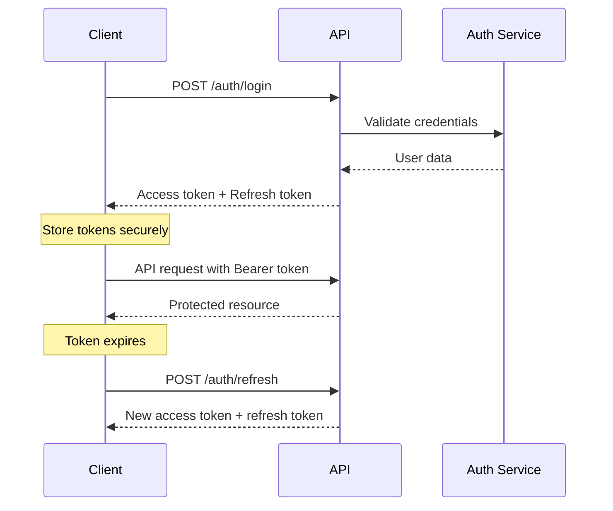

# SpheroSeg API Developer Guide

## Table of Contents

1. [Introduction](#introduction)
2. [Getting Started](#getting-started)
3. [Authentication](#authentication)
4. [Core API Concepts](#core-api-concepts)
5. [API Endpoints Reference](#api-endpoints-reference)
6. [Real-time Communication](#real-time-communication)
7. [Error Handling](#error-handling)
8. [Best Practices](#best-practices)
9. [Code Examples](#code-examples)
10. [Troubleshooting](#troubleshooting)

## Introduction

The SpheroSeg API provides a comprehensive REST interface for cell segmentation and analysis. This guide provides detailed information for developers integrating with the SpheroSeg platform.

### Key Features

- **Cell Segmentation**: ML-powered cell detection and analysis
- **Project Management**: Organize images and results by project
- **Real-time Updates**: WebSocket notifications for processing status
- **File Management**: Support for multiple image formats (JPEG, PNG, TIFF, BMP)
- **User Management**: Complete authentication and profile management
- **Statistics & Analytics**: Comprehensive usage statistics and reporting

### API Version

Current API version: **v1.0.0**

Base URLs:
- Development: `http://localhost:5001/api`
- Production: `https://spherosegapp.utia.cas.cz/api`

## Getting Started

### Prerequisites

- Valid SpheroSeg account
- API client capable of HTTP requests
- Understanding of REST API concepts
- For real-time features: WebSocket support

### Quick Start Flow

1. **Authenticate** - Get JWT tokens
2. **Create Project** - Organize your work
3. **Upload Images** - Add images to your project
4. **Process Images** - Trigger segmentation
5. **Monitor Progress** - Track processing status
6. **Retrieve Results** - Download segmentation data

## Authentication

SpheroSeg uses JWT (JSON Web Tokens) for authentication with a refresh token mechanism.

### Authentication Flow



### Token Management

**Access Token**:
- Short-lived (15 minutes)
- Used for API authentication
- Include in `Authorization: Bearer <token>` header

**Refresh Token**:
- Long-lived (7 days)
- Used to obtain new access tokens
- Store securely (HTTP-only cookies recommended)

### Authentication Endpoints

| Endpoint | Method | Purpose |
|----------|---------|---------|
| `/auth/register` | POST | Create new user account |
| `/auth/login` | POST | Authenticate and get tokens |
| `/auth/refresh` | POST | Refresh access token |
| `/auth/logout` | POST | Invalidate session |
| `/auth/me` | GET | Get current user info |

## Core API Concepts

### Resource Organization

The API follows a hierarchical resource structure:

```
Users
├── Projects
│   ├── Images
│   │   ├── Segmentation Results
│   │   └── Metadata
│   └── Statistics
└── User Profile & Settings
```

### Request/Response Format

**Content Type**: `application/json` (except file uploads)

**Standard Response Structure**:
```json
{
  "success": true,
  "data": { /* response data */ },
  "message": "Operation completed successfully",
  "timestamp": "2023-12-01T10:30:00Z"
}
```

**Error Response Structure**:
```json
{
  "success": false,
  "error": "ERROR_CODE",
  "message": "Human-readable error message",
  "details": { /* additional error context */ },
  "timestamp": "2023-12-01T10:30:00Z"
}
```

### Pagination

List endpoints support pagination:

```json
{
  "data": [...],
  "pagination": {
    "total": 150,
    "limit": 20,
    "offset": 40,
    "page": 3,
    "totalPages": 8
  }
}
```

### HTTP Status Codes

| Code | Meaning | Usage |
|------|---------|-------|
| 200 | OK | Successful GET, PUT requests |
| 201 | Created | Successful POST requests |
| 204 | No Content | Successful DELETE requests |
| 400 | Bad Request | Invalid request data |
| 401 | Unauthorized | Authentication required |
| 403 | Forbidden | Insufficient permissions |
| 404 | Not Found | Resource doesn't exist |
| 409 | Conflict | Resource already exists |
| 422 | Unprocessable Entity | Business logic error |
| 429 | Too Many Requests | Rate limit exceeded |
| 500 | Internal Server Error | Server error |

## API Endpoints Reference

### Authentication Endpoints

#### POST /auth/register
Register a new user account.

**Request**:
```json
{
  "email": "user@example.com",
  "password": "securePassword123",
  "name": "John Doe",
  "preferred_language": "en"
}
```

**Response**:
```json
{
  "success": true,
  "message": "Registration successful",
  "user": {
    "id": "123e4567-e89b-12d3-a456-426614174000",
    "email": "user@example.com",
    "name": "John Doe"
  },
  "tokens": {
    "accessToken": "eyJhbGciOiJSUzI1NiIs...",
    "refreshToken": "eyJhbGciOiJSUzI1NiIs...",
    "expiresIn": 900
  }
}
```

#### POST /auth/login
Authenticate user and receive tokens.

**Request**:
```json
{
  "email": "user@example.com",
  "password": "securePassword123",
  "remember_me": false
}
```

#### POST /auth/refresh
Refresh access token using refresh token.

**Request**:
```json
{
  "refreshToken": "eyJhbGciOiJSUzI1NiIs..."
}
```

### User Management Endpoints

#### GET /users/me
Get current user profile information.

**Headers**: `Authorization: Bearer <token>`

**Response**:
```json
{
  "id": "123e4567-e89b-12d3-a456-426614174000",
  "email": "user@example.com",
  "created_at": "2023-12-01T10:30:00Z",
  "profile": {
    "username": "john_doe",
    "full_name": "John Doe",
    "title": "Research Scientist",
    "organization": "University Lab",
    "bio": "Cell biology researcher",
    "location": "Boston, MA",
    "avatar_url": "https://example.com/avatar.jpg"
  }
}
```

#### PUT /users/me
Update user profile information.

**Request**:
```json
{
  "name": "John Doe",
  "username": "john_doe_updated",
  "title": "Senior Research Scientist",
  "organization": "New University Lab",
  "bio": "Experienced cell biology researcher",
  "location": "Cambridge, MA"
}
```

#### GET /users/me/statistics
Get comprehensive user statistics.

**Response**:
```json
{
  "totalProjects": 5,
  "totalImages": 150,
  "completedSegmentations": 120,
  "storageUsedBytes": "1073741824",
  "storageLimitBytes": "10737418240",
  "storageUsedMB": 1024.0,
  "recentActivity": [
    {
      "type": "image_uploaded",
      "item_id": "image-uuid",
      "item_name": "cell_sample_001.jpg",
      "timestamp": "2023-12-01T10:30:00Z",
      "project_id": "project-uuid",
      "project_name": "Cancer Cell Study"
    }
  ]
}
```

### Project Management Endpoints

#### GET /projects
List user projects with pagination.

**Query Parameters**:
- `limit` (optional): Maximum items to return (1-100, default: 10)
- `offset` (optional): Items to skip (default: 0)
- `includeShared` (optional): Include shared projects (default: true)

**Response**:
```json
{
  "projects": [
    {
      "id": "123e4567-e89b-12d3-a456-426614174000",
      "title": "Cell Analysis Project",
      "description": "Analysis of cancer cell morphology",
      "user_id": "user-uuid",
      "created_at": "2023-12-01T10:30:00Z",
      "updated_at": "2023-12-01T10:30:00Z",
      "image_count": 25,
      "thumbnail_url": "https://example.com/thumbnail.jpg"
    }
  ],
  "total": 5,
  "limit": 10,
  "offset": 0
}
```

#### POST /projects
Create a new project.

**Request**:
```json
{
  "title": "Cell Analysis Project",
  "description": "Analysis of cancer cell morphology",
  "tags": ["cancer", "research", "morphology"],
  "public": false
}
```

#### GET /projects/{projectId}
Get project details by ID.

**Special case**: Use `"new"` as projectId to get empty project template.

#### PUT /projects/{projectId}
Update project information.

#### DELETE /projects/{projectId}
Delete project and all associated data.

#### GET /projects/{projectId}/images
List all images in a project.

### Image Management Endpoints

#### POST /projects/{projectId}/images
Upload images to a project.

**Content-Type**: `multipart/form-data`

**Form Data**:
- `images`: File array (max 20 files, 50MB each)

**Supported Formats**: JPEG, PNG, TIFF, BMP

**Response**:
```json
{
  "uploaded": [
    {
      "id": "image-uuid",
      "name": "cell_sample_001.tiff",
      "size": 1048576,
      "width": 1024,
      "height": 768,
      "format": "TIFF",
      "storage_path": "/uploads/project-uuid/image-uuid.tiff",
      "thumbnail_path": "/thumbnails/image-uuid_thumb.jpg",
      "status": "without_segmentation"
    }
  ],
  "failed": [],
  "summary": {
    "total": 1,
    "successful": 1,
    "failed": 0
  }
}
```

#### GET /images/{imageId}
Get image details and metadata.

#### DELETE /images/{imageId}
Delete a single image.

#### POST /projects/{projectId}/images/batch-delete
Delete multiple images.

**Request**:
```json
{
  "imageIds": ["image-uuid-1", "image-uuid-2"]
}
```

### Segmentation Endpoints

#### GET /images/{imageId}/segmentation
Get segmentation result for an image.

**Response**:
```json
{
  "id": "segmentation-uuid",
  "image_id": "image-uuid",
  "status": "completed",
  "progress": 100,
  "created_at": "2023-12-01T10:30:00Z",
  "completed_at": "2023-12-01T10:35:00Z",
  "processing_time": 300,
  "results": {
    "cell_count": 45,
    "polygons": [...],
    "features": {...},
    "confidence_score": 0.95
  }
}
```

#### POST /images/{imageId}/segmentation
Trigger segmentation for an image.

#### POST /projects/{projectId}/segmentation/batch-trigger
Trigger batch segmentation for multiple images.

**Request**:
```json
{
  "imageIds": ["image-uuid-1", "image-uuid-2"]
}
```

#### DELETE /images/{imageId}/segmentation
Cancel ongoing segmentation.

#### GET /segmentation/queue
Get segmentation queue status.

## Real-time Communication

### WebSocket Connection

Connect to `/socket.io/` endpoint with JWT authentication:

```javascript
import io from 'socket.io-client';

const socket = io('http://localhost:5001', {
  auth: {
    token: 'your-jwt-token'
  }
});

// Connection events
socket.on('connect', () => {
  console.log('Connected to server');
});

socket.on('disconnect', () => {
  console.log('Disconnected from server');
});

// Authentication events
socket.on('authenticated', (data) => {
  console.log('Authenticated:', data);
});

socket.on('authentication_error', (error) => {
  console.error('Authentication failed:', error);
});
```

### Real-time Events

#### Segmentation Events

```javascript
// Segmentation progress updates
socket.on('segmentation-progress', (data) => {
  console.log(`Image ${data.imageId}: ${data.progress}% complete`);
  updateProgressBar(data.imageId, data.progress);
});

// Segmentation completion
socket.on('segmentation-complete', (data) => {
  console.log(`Segmentation completed for image ${data.imageId}`);
  refreshImageData(data.imageId);
});

// Segmentation failure
socket.on('segmentation-failed', (data) => {
  console.error(`Segmentation failed for image ${data.imageId}:`, data.error);
  showErrorMessage(data.error);
});

// Queue status updates
socket.on('queue-status', (data) => {
  console.log(`Queue status: ${data.pending} pending, ${data.processing} processing`);
  updateQueueDisplay(data);
});
```

#### Project Events

```javascript
// Project updates
socket.on('project-updated', (data) => {
  console.log(`Project ${data.projectId} updated`);
  refreshProjectData(data.projectId);
});

// Image upload events
socket.on('image-uploaded', (data) => {
  console.log(`New image uploaded: ${data.imageId}`);
  addImageToGallery(data.image);
});

// Image deletion events
socket.on('image-deleted', (data) => {
  console.log(`Image deleted: ${data.imageId}`);
  removeImageFromGallery(data.imageId);
});
```

## Error Handling

### Error Response Format

```json
{
  "success": false,
  "error": "ERROR_CODE",
  "message": "Human-readable error message",
  "details": {
    "field": "email",
    "validation": "Invalid email format"
  },
  "timestamp": "2023-12-01T10:30:00Z",
  "requestId": "req_123456789"
}
```

### Common Error Codes

| Error Code | HTTP Status | Description |
|------------|-------------|-------------|
| `VALIDATION_ERROR` | 400 | Request validation failed |
| `AUTHENTICATION_REQUIRED` | 401 | Authentication token required |
| `INVALID_CREDENTIALS` | 401 | Login credentials invalid |
| `INSUFFICIENT_PERMISSIONS` | 403 | User lacks required permissions |
| `RESOURCE_NOT_FOUND` | 404 | Requested resource doesn't exist |
| `RESOURCE_CONFLICT` | 409 | Resource already exists |
| `RATE_LIMIT_EXCEEDED` | 429 | Too many requests |
| `FILE_TOO_LARGE` | 413 | Uploaded file exceeds size limit |
| `UNSUPPORTED_FORMAT` | 422 | File format not supported |
| `STORAGE_QUOTA_EXCEEDED` | 422 | User storage limit reached |
| `SEGMENTATION_FAILED` | 422 | ML processing failed |
| `INTERNAL_ERROR` | 500 | Server error |

### Error Handling Best Practices

1. **Always check the `success` field** in responses
2. **Use error codes** for programmatic error handling
3. **Display user-friendly messages** from the `message` field
4. **Log request IDs** for debugging purposes
5. **Implement retry logic** for transient errors (5xx codes)
6. **Handle authentication errors** with token refresh

## Best Practices

### Authentication

1. **Store tokens securely** - Use secure storage mechanisms
2. **Implement token refresh** - Handle expired tokens gracefully
3. **Use HTTPS** - Always use secure connections
4. **Validate tokens** - Check token expiration before requests

### API Usage

1. **Respect rate limits** - Implement backoff strategies
2. **Use pagination** - Don't fetch all data at once
3. **Cache responses** - Cache immutable data locally
4. **Handle errors gracefully** - Provide fallbacks for failures

### File Uploads

1. **Validate files client-side** - Check format and size before upload
2. **Show progress** - Implement upload progress indicators
3. **Handle large files** - Consider chunked uploads for large files
4. **Optimize images** - Compress images when appropriate

### Real-time Updates

1. **Handle disconnections** - Implement reconnection logic
2. **Debounce updates** - Avoid UI thrashing with rapid updates
3. **Fallback to polling** - Use polling as backup for WebSocket failures
4. **Manage subscriptions** - Clean up event listeners properly

### Performance

1. **Use WebSockets** - For real-time updates instead of polling
2. **Batch operations** - Combine multiple operations when possible
3. **Optimize payloads** - Only request needed data
4. **Implement caching** - Cache frequently accessed data

## Code Examples

### JavaScript/TypeScript SDK

```typescript
import axios, { AxiosInstance } from 'axios';
import io, { Socket } from 'socket.io-client';

class SpheroSegAPI {
  private api: AxiosInstance;
  private socket: Socket | null = null;
  private accessToken: string | null = null;
  private refreshToken: string | null = null;

  constructor(baseURL: string) {
    this.api = axios.create({
      baseURL: baseURL + '/api',
      timeout: 30000,
    });

    // Request interceptor for authentication
    this.api.interceptors.request.use((config) => {
      if (this.accessToken) {
        config.headers.Authorization = `Bearer ${this.accessToken}`;
      }
      return config;
    });

    // Response interceptor for token refresh
    this.api.interceptors.response.use(
      (response) => response,
      async (error) => {
        if (error.response?.status === 401 && this.refreshToken) {
          await this.refreshAccessToken();
          return this.api.request(error.config);
        }
        return Promise.reject(error);
      }
    );
  }

  // Authentication methods
  async login(email: string, password: string): Promise<void> {
    const response = await this.api.post('/auth/login', {
      email,
      password,
    });

    const { tokens } = response.data;
    this.accessToken = tokens.accessToken;
    this.refreshToken = tokens.refreshToken;

    // Store tokens securely
    localStorage.setItem('accessToken', this.accessToken);
    localStorage.setItem('refreshToken', this.refreshToken);
  }

  async refreshAccessToken(): Promise<void> {
    if (!this.refreshToken) {
      throw new Error('No refresh token available');
    }

    const response = await this.api.post('/auth/refresh', {
      refreshToken: this.refreshToken,
    });

    const { tokens } = response.data;
    this.accessToken = tokens.accessToken;
    this.refreshToken = tokens.refreshToken;

    // Update stored tokens
    localStorage.setItem('accessToken', this.accessToken);
    localStorage.setItem('refreshToken', this.refreshToken);
  }

  // User methods
  async getCurrentUser() {
    const response = await this.api.get('/users/me');
    return response.data;
  }

  async getUserStatistics() {
    const response = await this.api.get('/users/me/statistics');
    return response.data;
  }

  // Project methods
  async getProjects(limit = 20, offset = 0) {
    const response = await this.api.get('/projects', {
      params: { limit, offset },
    });
    return response.data;
  }

  async createProject(data: {
    title: string;
    description?: string;
    tags?: string[];
  }) {
    const response = await this.api.post('/projects', data);
    return response.data;
  }

  async getProject(projectId: string) {
    const response = await this.api.get(`/projects/${projectId}`);
    return response.data;
  }

  // Image methods
  async uploadImages(projectId: string, files: File[]) {
    const formData = new FormData();
    files.forEach((file) => {
      formData.append('images', file);
    });

    const response = await this.api.post(
      `/projects/${projectId}/images`,
      formData,
      {
        headers: {
          'Content-Type': 'multipart/form-data',
        },
        onUploadProgress: (progressEvent) => {
          const progress = Math.round(
            (progressEvent.loaded * 100) / (progressEvent.total || 1)
          );
          console.log(`Upload progress: ${progress}%`);
        },
      }
    );

    return response.data;
  }

  async getProjectImages(projectId: string) {
    const response = await this.api.get(`/projects/${projectId}/images`);
    return response.data;
  }

  // Segmentation methods
  async triggerSegmentation(imageId: string) {
    const response = await this.api.post(`/images/${imageId}/segmentation`);
    return response.data;
  }

  async getSegmentationResult(imageId: string) {
    const response = await this.api.get(`/images/${imageId}/segmentation`);
    return response.data;
  }

  async triggerBatchSegmentation(projectId: string, imageIds: string[]) {
    const response = await this.api.post(
      `/projects/${projectId}/segmentation/batch-trigger`,
      { imageIds }
    );
    return response.data;
  }

  // WebSocket methods
  connectWebSocket(baseURL: string): void {
    this.socket = io(baseURL, {
      auth: {
        token: this.accessToken,
      },
    });

    this.socket.on('connect', () => {
      console.log('Connected to WebSocket');
    });

    this.socket.on('disconnect', () => {
      console.log('Disconnected from WebSocket');
    });

    this.socket.on('segmentation-progress', (data) => {
      console.log(`Segmentation progress: ${data.progress}%`);
    });

    this.socket.on('segmentation-complete', (data) => {
      console.log(`Segmentation completed for image: ${data.imageId}`);
    });
  }

  disconnectWebSocket(): void {
    if (this.socket) {
      this.socket.disconnect();
      this.socket = null;
    }
  }
}

// Usage example
const api = new SpheroSegAPI('http://localhost:5001');

async function main() {
  try {
    // Login
    await api.login('user@example.com', 'password123');
    
    // Connect WebSocket
    api.connectWebSocket('http://localhost:5001');
    
    // Get user info
    const user = await api.getCurrentUser();
    console.log('Current user:', user);
    
    // Create project
    const project = await api.createProject({
      title: 'Test Project',
      description: 'Test project for API demo',
    });
    console.log('Created project:', project);
    
    // Upload images (requires File objects)
    // const files = [file1, file2]; // File objects from input
    // const uploadResult = await api.uploadImages(project.id, files);
    // console.log('Upload result:', uploadResult);
    
  } catch (error) {
    console.error('API Error:', error);
  }
}
```

### Python SDK Example

```python
import requests
import socketio
from typing import Optional, List, Dict, Any
import json

class SpheroSegAPI:
    def __init__(self, base_url: str):
        self.base_url = base_url
        self.api_url = f"{base_url}/api"
        self.session = requests.Session()
        self.access_token: Optional[str] = None
        self.refresh_token: Optional[str] = None
        self.sio = socketio.Client()
        self._setup_socket_events()

    def _setup_socket_events(self):
        @self.sio.event
        def connect():
            print("Connected to WebSocket")

        @self.sio.event
        def disconnect():
            print("Disconnected from WebSocket")

        @self.sio.on('segmentation-progress')
        def on_segmentation_progress(data):
            print(f"Segmentation progress: {data['progress']}%")

        @self.sio.on('segmentation-complete')
        def on_segmentation_complete(data):
            print(f"Segmentation completed for image: {data['imageId']}")

    def _make_request(self, method: str, endpoint: str, **kwargs) -> Dict[Any, Any]:
        url = f"{self.api_url}{endpoint}"
        
        if self.access_token:
            headers = kwargs.get('headers', {})
            headers['Authorization'] = f"Bearer {self.access_token}"
            kwargs['headers'] = headers

        response = self.session.request(method, url, **kwargs)
        
        if response.status_code == 401 and self.refresh_token:
            self.refresh_access_token()
            # Retry request with new token
            headers = kwargs.get('headers', {})
            headers['Authorization'] = f"Bearer {self.access_token}"
            kwargs['headers'] = headers
            response = self.session.request(method, url, **kwargs)

        if not response.ok:
            raise requests.HTTPError(f"API request failed: {response.status_code} {response.text}")
        
        return response.json()

    def login(self, email: str, password: str) -> Dict[str, Any]:
        data = {
            "email": email,
            "password": password
        }
        response = self._make_request('POST', '/auth/login', json=data)
        
        tokens = response.get('tokens', {})
        self.access_token = tokens.get('accessToken')
        self.refresh_token = tokens.get('refreshToken')
        
        return response

    def refresh_access_token(self) -> Dict[str, Any]:
        if not self.refresh_token:
            raise ValueError("No refresh token available")
        
        data = {"refreshToken": self.refresh_token}
        response = self._make_request('POST', '/auth/refresh', json=data)
        
        tokens = response.get('tokens', {})
        self.access_token = tokens.get('accessToken')
        self.refresh_token = tokens.get('refreshToken')
        
        return response

    def get_current_user(self) -> Dict[str, Any]:
        return self._make_request('GET', '/users/me')

    def get_user_statistics(self) -> Dict[str, Any]:
        return self._make_request('GET', '/users/me/statistics')

    def get_projects(self, limit: int = 20, offset: int = 0) -> Dict[str, Any]:
        params = {"limit": limit, "offset": offset}
        return self._make_request('GET', '/projects', params=params)

    def create_project(self, title: str, description: str = "", tags: List[str] = None) -> Dict[str, Any]:
        data = {
            "title": title,
            "description": description,
            "tags": tags or []
        }
        return self._make_request('POST', '/projects', json=data)

    def upload_images(self, project_id: str, file_paths: List[str]) -> Dict[str, Any]:
        files = []
        for file_path in file_paths:
            files.append(('images', open(file_path, 'rb')))
        
        try:
            response = self._make_request('POST', f'/projects/{project_id}/images', files=files)
            return response
        finally:
            # Close file handles
            for _, file_handle in files:
                file_handle.close()

    def trigger_segmentation(self, image_id: str) -> Dict[str, Any]:
        return self._make_request('POST', f'/images/{image_id}/segmentation')

    def get_segmentation_result(self, image_id: str) -> Dict[str, Any]:
        return self._make_request('GET', f'/images/{image_id}/segmentation')

    def connect_websocket(self):
        if self.access_token:
            self.sio.connect(self.base_url, auth={'token': self.access_token})

    def disconnect_websocket(self):
        self.sio.disconnect()

# Usage example
if __name__ == "__main__":
    api = SpheroSegAPI('http://localhost:5001')
    
    try:
        # Login
        login_result = api.login('user@example.com', 'password123')
        print("Login successful:", login_result)
        
        # Connect WebSocket
        api.connect_websocket()
        
        # Get user info
        user = api.get_current_user()
        print("Current user:", user)
        
        # Create project
        project = api.create_project(
            title="Python API Test",
            description="Test project created with Python SDK"
        )
        print("Created project:", project)
        
        # Upload images
        # upload_result = api.upload_images(project['id'], ['image1.jpg', 'image2.png'])
        # print("Upload result:", upload_result)
        
    except Exception as e:
        print(f"Error: {e}")
    finally:
        api.disconnect_websocket()
```

## Troubleshooting

### Common Issues

#### Authentication Problems

**Issue**: 401 Unauthorized errors
**Solutions**:
1. Check if access token is included in requests
2. Verify token hasn't expired
3. Implement token refresh logic
4. Ensure proper Authorization header format

**Issue**: Token refresh fails
**Solutions**:
1. Check if refresh token is valid
2. Verify refresh token hasn't expired
3. Re-authenticate user if refresh fails

#### File Upload Issues

**Issue**: File upload fails with 413 error
**Solutions**:
1. Check file size limits (50MB per file)
2. Verify total upload size (500MB per batch)
3. Compress images if necessary

**Issue**: Unsupported file format error
**Solutions**:
1. Verify file format (JPEG, PNG, TIFF, BMP only)
2. Check file extension matches content
3. Ensure file isn't corrupted

#### Segmentation Problems

**Issue**: Segmentation takes too long
**Solutions**:
1. Check image size and complexity
2. Monitor queue status
3. Use WebSocket for progress updates
4. Consider breaking large batches into smaller ones

**Issue**: Segmentation fails
**Solutions**:
1. Check image quality and format
2. Verify image dimensions are within limits
3. Check server logs for specific errors
4. Retry with different images

#### Rate Limiting

**Issue**: 429 Too Many Requests
**Solutions**:
1. Implement exponential backoff
2. Respect rate limit headers
3. Reduce request frequency
4. Cache responses to reduce API calls

#### WebSocket Issues

**Issue**: WebSocket connection fails
**Solutions**:
1. Check network connectivity
2. Verify JWT token is valid
3. Check firewall/proxy settings
4. Implement fallback to HTTP polling

### Debugging Tips

1. **Enable request logging** - Log all API requests and responses
2. **Check response headers** - Look for rate limit and error information
3. **Use request IDs** - Include request IDs in bug reports
4. **Monitor WebSocket events** - Log all WebSocket events for debugging
5. **Test with Postman** - Use API testing tools to isolate issues

### Support Resources

- **Documentation**: Complete API reference and guides
- **GitHub Issues**: Report bugs and request features
- **Email Support**: spheroseg@utia.cas.cz
- **Status Page**: Check service status and incidents

---

This developer guide provides comprehensive information for integrating with the SpheroSeg API. For the most up-to-date information, always refer to the OpenAPI specification and official documentation.