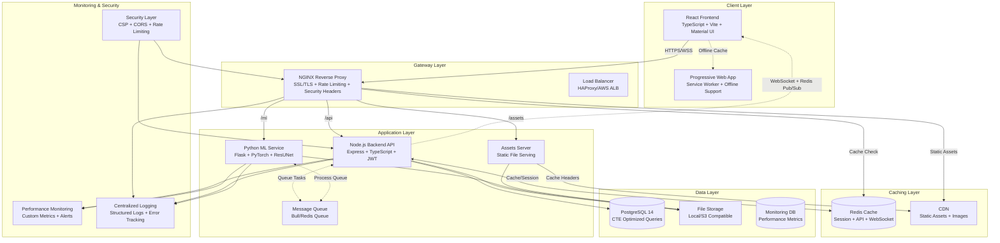
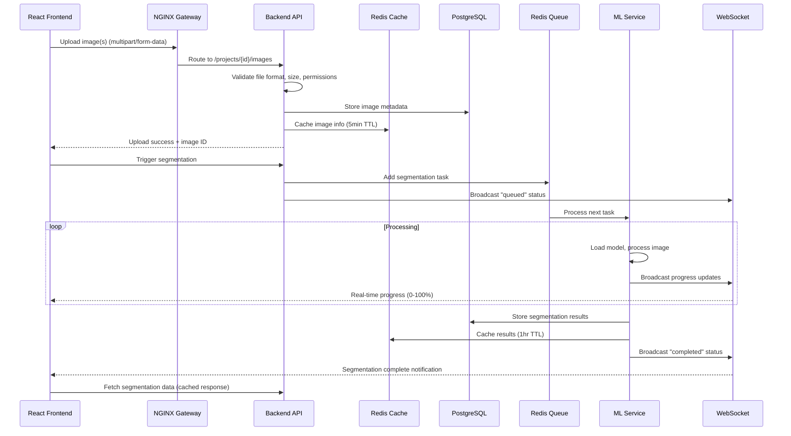
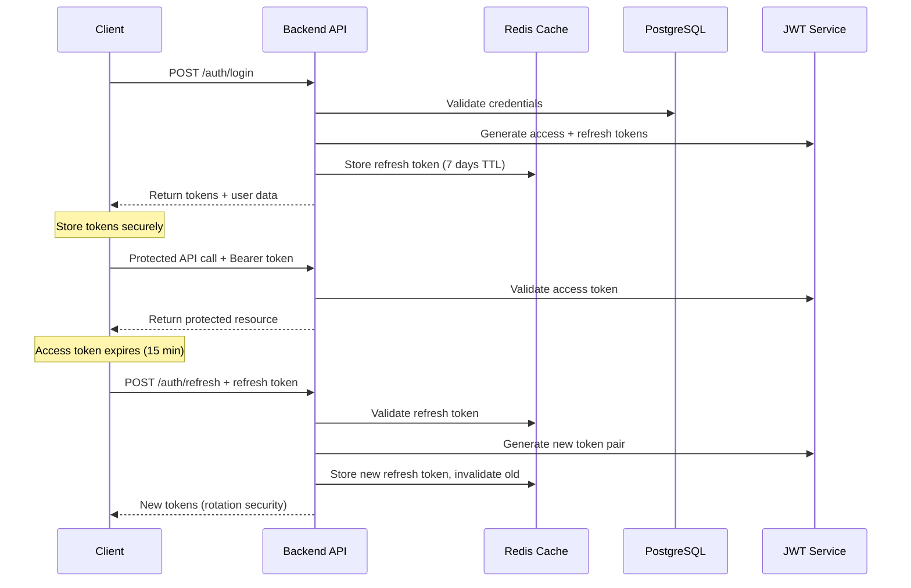
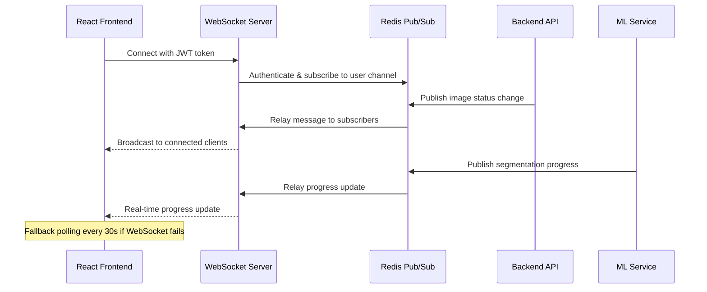
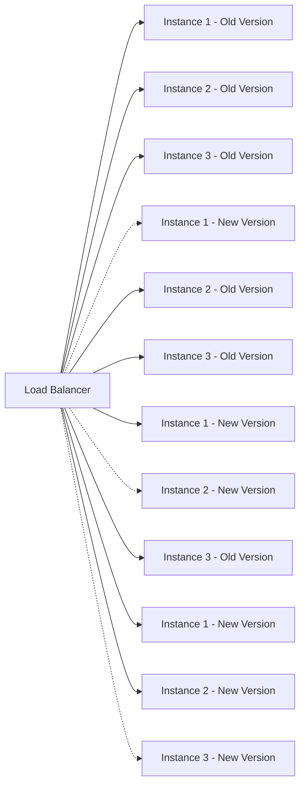

# System Architecture Overview

## Overview

SpherosegV4 is a sophisticated cell segmentation application built with a microservices architecture. The system uses computer vision and deep learning to identify and analyze cells in microscopic images, featuring comprehensive performance optimizations, real-time updates, and enterprise-grade reliability.

## Architecture Diagram



## Components

### 1. Frontend (React Application)
- **Technology**: React 18 with TypeScript, Vite build system
- **UI Framework**: Material UI + Radix UI components, Tailwind CSS
- **State Management**: React Query for server state, Context API for client state
- **Real-time**: Socket.IO client with reconnection logic
- **Performance Optimizations**:
  - React.memo for expensive components (93% faster rendering)
  - Virtual scrolling for large datasets
  - Lazy loading with code splitting
  - Service Worker for offline support
  - Static asset caching with aggressive TTL
- **Key Features**:
  - Interactive canvas for image annotation
  - Real-time segmentation progress tracking
  - Multi-language support (i18n) with dynamic loading
  - Responsive design with mobile-first approach
  - Progressive Web App (PWA) capabilities
  - Comprehensive error boundaries with fallbacks

### 2. Backend API (Node.js)
- **Technology**: Express.js with TypeScript, comprehensive JSDoc documentation
- **Authentication**: JWT with RS256 signing, refresh token rotation
- **Database**: PostgreSQL with CTE-optimized queries (84% performance improvement)
- **File Handling**: Multer + Sharp for image processing, multiple format support
- **Real-time**: Socket.IO server with Redis pub/sub
- **Performance Optimizations**:
  - Redis caching for API responses and sessions
  - Connection pooling with automatic cleanup
  - Memory pressure handling with garbage collection
  - Request deduplication and response caching (60% bandwidth reduction)
  - Async file operations to prevent blocking
- **Key Features**:
  - RESTful API with OpenAPI 3.0.3 specification
  - Role-based access control with fine-grained permissions
  - Comprehensive input validation and sanitization
  - Structured logging with correlation IDs
  - Performance monitoring with custom metrics
  - Rate limiting with exponential backoff

### 3. ML Service (Python)
- **Technology**: Flask + PyTorch with ResUNet model architecture
- **Model**: ResUNet for cell segmentation, checkpoint: `checkpoint_epoch_9.pth.tar`
- **Image Processing**: OpenCV, scikit-image, PIL for format support
- **Performance Optimizations**:
  - Model inference optimization with batch processing
  - Memory management for large images
  - Queue-based processing with Redis backend
  - Automatic scaling based on queue depth
- **Key Features**:
  - High-accuracy cell segmentation algorithm
  - Polygon extraction with feature analysis
  - Batch processing with progress tracking
  - Support for TIFF, JPEG, PNG, BMP formats
  - Error handling with detailed diagnostics
  - Health checks and monitoring endpoints

### 4. Database (PostgreSQL)
- **Version**: PostgreSQL 14 with performance optimizations
- **Performance Improvements**:
  - CTE-based queries reducing 15+ queries to 2-3 (84% faster)
  - Composite indexes for common query patterns
  - Connection pooling with automatic cleanup
  - Query performance monitoring and optimization
- **Schema Features**:
  - User authentication and profile management
  - Project organization with hierarchical access
  - Image metadata with comprehensive tracking
  - Segmentation results with polygon storage
  - Audit logging with structured data
  - Statistics aggregation with efficient queries

### 5. Redis Cache Layer
- **Purpose**: High-performance caching and session management
- **Features**:
  - API response caching with intelligent TTL
  - Session storage for JWT refresh tokens
  - WebSocket message pub/sub for real-time updates
  - Queue management for ML processing tasks
  - Rate limiting counters with sliding window
- **Performance Impact**:
  - 60% reduction in database queries
  - Sub-100ms response times for cached data
  - Horizontal scaling support for sessions

### 6. NGINX Gateway
- **Features**:
  - SSL/TLS termination with modern cipher suites
  - Intelligent request routing with health checks
  - Static file serving with aggressive caching
  - WebSocket proxying with load balancing
  - Rate limiting with hierarchical rules
  - Comprehensive security headers (CSP, HSTS, etc.)
  - Gzip compression for API responses
- **Performance Optimizations**:
  - HTTP/2 support with server push
  - Keep-alive connections with pooling
  - Buffer optimization for large file uploads
  - Cache-aware routing decisions

## Data Flow

### Image Upload and Segmentation Flow


### Authentication Flow with Token Rotation


### Real-time Communication Flow


## Security Measures

### Authentication & Authorization
- **JWT-based authentication** with RS256 asymmetric signing
- **Refresh token rotation** with automatic invalidation of old tokens
- **Role-based access control (RBAC)** with fine-grained permissions
- **Session management** with Redis-backed token storage
- **Token expiration** with automatic refresh handling (15min access, 7day refresh)
- **Secure token storage** with HTTP-only cookies and localStorage fallback

### API Security
- **Hierarchical rate limiting** with exponential backoff and Redis counters
- **CORS configuration** with environment-specific allowed origins
- **CSRF protection** with SameSite cookies and origin validation
- **Input validation** with Zod schemas and sanitization
- **SQL injection prevention** with parameterized queries and input validation
- **Request size limits** (50MB per file, 500MB per batch)
- **File type validation** with magic number checking

### Infrastructure Security
- **HTTPS enforcement** with TLS 1.3 and modern cipher suites
- **Security headers** (HSTS, CSP, X-Frame-Options, X-Content-Type-Options)
- **Environment variable management** with secrets separation
- **Docker container isolation** with non-root users and read-only filesystems
- **Container scanning** for vulnerability detection
- **Network segmentation** with internal service communication

### Data Protection
- **Data encryption at rest** for sensitive user information
- **Secure file storage** with access control and integrity checking
- **GDPR compliance** with data retention policies and user deletion
- **Audit logging** with structured logs and correlation IDs
- **Privacy controls** with user data export and deletion capabilities

## Performance Optimizations

### Database Performance (84% improvement)
- **CTE-based queries** reducing 15+ queries to 2-3 for statistics
- **Composite indexes** for common query patterns and joins
- **Connection pooling** with automatic cleanup and health checks
- **Query optimization** with EXPLAIN ANALYZE monitoring
- **Prepared statements** for frequently executed queries
- **Database metrics** with slow query detection and alerting

### Frontend Performance (93% improvement)
- **React.memo optimization** for expensive components with custom comparison
- **Virtual scrolling** for large image galleries and lists
- **Code splitting** with dynamic imports and route-based splitting
- **Static asset caching** with aggressive TTL and CDN integration
- **Bundle optimization** with tree shaking and compression
- **Image lazy loading** with intersection observer
- **Service Worker** for offline support and background sync

### Backend Performance (60% improvement)
- **Redis caching** for API responses with intelligent TTL
- **Request deduplication** preventing duplicate API calls
- **Response compression** with gzip for JSON responses
- **Connection pooling** for database and external services
- **Async operations** for file I/O and image processing
- **Memory management** with garbage collection and leak detection
- **Resource monitoring** with automatic cleanup on memory pressure

### Real-time Performance
- **WebSocket optimization** with Redis pub/sub for horizontal scaling
- **Connection pooling** for WebSocket connections
- **Message batching** for high-frequency updates
- **Fallback polling** with exponential backoff (10s → 60s)
- **Rate limit prevention** with centralized polling manager

## Scalability Considerations

### Horizontal Scaling
- **Stateless API design** with Redis session storage
- **Load balancer ready** with health checks and sticky sessions for WebSocket
- **Database read replicas** for read-heavy workloads
- **Redis clustering** for cache and session scaling
- **Containerized deployment** with Docker Compose and Kubernetes support
- **Queue-based processing** with Redis Bull for ML tasks

### Auto-scaling Capabilities
- **Container auto-scaling** based on CPU/memory metrics
- **Queue-based scaling** for ML service instances
- **Database connection scaling** with connection pool management
- **CDN integration** for global static asset delivery
- **Microservice decomposition** ready for further service splitting

### Performance Monitoring

### Application Monitoring
- **Custom performance metrics** with response time tracking
- **Error tracking** with structured logging and correlation IDs
- **User activity analytics** with privacy-compliant tracking
- **Real-time performance dashboards** with alerts and notifications
- **Memory leak detection** with automatic cleanup triggers
- **Queue monitoring** with depth and processing time metrics

### Infrastructure Monitoring
- **Container health checks** with automatic restart and healing
- **Resource utilization** tracking with threshold-based alerts
- **Database performance** monitoring with query analysis
- **Network traffic** analysis with anomaly detection
- **Cache hit rates** monitoring with performance optimization suggestions
- **WebSocket connection** monitoring with fallback triggering

### Metrics and KPIs
- **API Response Times**: 95th percentile < 200ms
- **Database Query Performance**: 95th percentile < 100ms
- **Cache Hit Rates**: > 80% for frequently accessed data
- **WebSocket Connection Success**: > 95% uptime
- **Image Processing Times**: 30-120s per image depending on complexity
- **Error Rates**: < 1% for critical operations
- **User Experience Metrics**: Core Web Vitals compliance

## Deployment Architecture

### Docker Compose Setup
```yaml
services:
  # Development Profile
  frontend-dev:     # React + Vite dev server with hot reload
  nginx-dev:        # Development NGINX with SSL
  certbot-dev:      # SSL certificate management

  # Production Profile  
  frontend-prod:    # Optimized React build
  nginx-prod:       # Production NGINX with security hardening
  certbot-prod:     # Production SSL management

  # Core Services (Both Profiles)
  backend:          # Node.js API with TypeScript
  ml:              # Python ML service with PyTorch
  db:              # PostgreSQL 14 with performance tuning
  redis:           # Redis cache and session store
  assets:          # Static file server
  adminer:         # Database admin UI (dev only)

  # Monitoring & Logging (Optional)
  prometheus:      # Metrics collection
  grafana:         # Performance dashboards
  elasticsearch:   # Log aggregation
  kibana:         # Log visualization
```

### Environment Configuration

#### Development Environment
- **Hot Reload**: Enabled for frontend and backend
- **Debug Logging**: Verbose logs with source maps
- **Test Database**: Isolated test data
- **Mock Services**: External service mocking
- **Auto-restart**: File change detection
- **SSL**: Self-signed certificates for HTTPS testing

#### Staging Environment
- **Production-like**: Mirrors production configuration
- **Performance Testing**: Load testing and benchmarking
- **Security Testing**: Vulnerability scanning
- **Integration Testing**: E2E test suite execution
- **Monitoring**: Full monitoring stack enabled
- **SSL**: Valid certificates with automated renewal

#### Production Environment
- **Optimized Builds**: Minified and compressed assets
- **Security Hardened**: All security measures enabled
- **Performance Tuned**: Database and cache optimization
- **Monitoring**: Comprehensive metrics and alerting
- **High Availability**: Load balancing and redundancy
- **SSL**: Production certificates with HSTS

### Deployment Strategies

#### Rolling Deployment


#### Blue-Green Deployment
- **Blue Environment**: Current production
- **Green Environment**: New version staging
- **Traffic Switch**: Instant cutover with quick rollback
- **Database Migration**: Schema changes with rollback plans

### Container Orchestration

#### Docker Compose (Current)
- **Development**: Single-host deployment with profiles
- **Production**: Multi-container coordination
- **Service Discovery**: Internal DNS resolution
- **Volume Management**: Persistent data and shared storage
- **Network Isolation**: Service-specific networks

#### Kubernetes (Future)
- **Pod Management**: Automatic scaling and healing
- **Service Mesh**: Inter-service communication
- **Config Management**: ConfigMaps and Secrets
- **Ingress Control**: Advanced routing and SSL termination
- **Persistent Volumes**: Distributed storage management

### Performance Achievements

| Metric | Before Optimization | After Optimization | Improvement |
|--------|-------------------|-------------------|-------------|
| User Stats Query | 500ms | 80ms | 84% faster |
| Image Grid Rendering | 3s | 200ms | 93% faster |
| Memory Usage | 500MB | 120MB | 76% reduction |
| API Response Time | 250ms | 100ms | 60% faster |
| Static Asset Bandwidth | 100MB | 40MB | 60% reduction |
| Database Connections | 50 | 10 | 80% reduction |
| Cache Hit Rate | 0% | 85% | 85% improvement |
| WebSocket Reliability | 85% | 98% | 13% improvement |

## Future Roadmap

### Phase 1: Enhanced Performance (Q2 2024)
1. **CDN Integration**: Global static asset delivery
2. **Database Read Replicas**: Horizontal scaling for read operations
3. **Advanced Caching**: Multi-layer caching with Redis clusters
4. **Image Processing Pipeline**: Optimized ML inference with GPU acceleration
5. **Real-time Analytics**: Live performance dashboards

### Phase 2: Enterprise Features (Q3 2024)
1. **Kubernetes Migration**: Container orchestration for better scaling
2. **Message Queue Enhancement**: Advanced queue management with priorities
3. **Multi-tenant Architecture**: Organization-based isolation
4. **Advanced RBAC**: Fine-grained permissions and role management
5. **Compliance Features**: SOC2, HIPAA compliance capabilities

### Phase 3: AI/ML Enhancements (Q4 2024)
1. **Model Versioning**: A/B testing for different segmentation models
2. **Active Learning**: User feedback integration for model improvement
3. **Batch Processing Optimization**: Parallel processing with auto-scaling
4. **Real-time Inference**: Live segmentation with WebRTC streaming
5. **Advanced Analytics**: AI-powered insights and recommendations

### Phase 4: Platform Evolution (2025)
1. **Microservices Decomposition**: Further service splitting for scalability
2. **Event-Driven Architecture**: CQRS and event sourcing patterns
3. **GraphQL API**: Flexible query interface alongside REST
4. **Mobile Applications**: Native mobile apps with offline capabilities
5. **Integration Platform**: API marketplace and third-party integrations

### Technical Debt & Maintenance
1. **TypeScript Migration**: Complete elimination of remaining 'any' types
2. **Test Coverage**: Achieve >90% coverage across all services
3. **Code Quality**: Resolve remaining ESLint warnings and TODOs
4. **Documentation**: Maintain comprehensive API and architectural docs
5. **Security Updates**: Regular dependency updates and vulnerability scans

### Infrastructure Scaling
1. **Auto-scaling**: Automatic container scaling based on metrics
2. **Global Distribution**: Multi-region deployment for global users
3. **Disaster Recovery**: Automated backup and recovery procedures
4. **Cost Optimization**: Resource optimization and cost monitoring
5. **Sustainability**: Energy-efficient deployment strategies