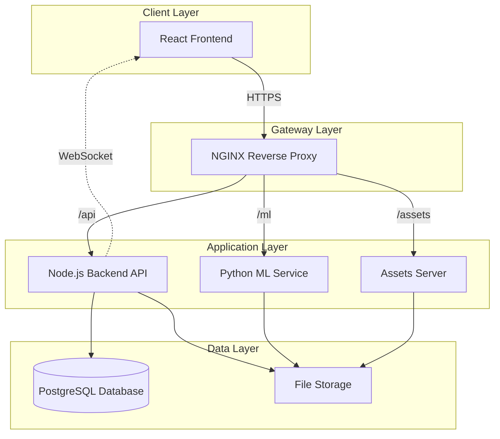

# System Architecture Overview

## Overview

SpherosegV4 is a sophisticated cell segmentation application built with a microservices architecture. The system uses computer vision and deep learning to identify and analyze cells in microscopic images.

## Architecture Diagram



## Components

### 1. Frontend (React Application)
- **Technology**: React 18 with TypeScript
- **Build Tool**: Vite
- **UI Framework**: Radix UI + Tailwind CSS
- **State Management**: React Query + Context API
- **Real-time**: Socket.IO client
- **Key Features**:
  - Interactive canvas for image annotation
  - Real-time segmentation results
  - Multi-language support (i18n)
  - Responsive design

### 2. Backend API (Node.js)
- **Technology**: Express.js with TypeScript
- **Authentication**: JWT with refresh tokens
- **Database**: PostgreSQL with custom SQL
- **File Handling**: Multer + Sharp
- **Real-time**: Socket.IO server
- **Key Features**:
  - RESTful API design
  - Role-based access control
  - File upload with validation
  - Image processing pipeline

### 3. ML Service (Python)
- **Technology**: Flask + PyTorch
- **Model**: ResUNet architecture
- **Image Processing**: OpenCV, scikit-image
- **Key Features**:
  - Cell segmentation algorithm
  - Polygon extraction
  - Batch processing support
  - Model inference optimization

### 4. Database (PostgreSQL)
- **Version**: PostgreSQL 14
- **Schema Features**:
  - User authentication tables
  - Project management
  - Image metadata
  - Segmentation results
  - Audit logging

### 5. NGINX Gateway
- **Features**:
  - SSL/TLS termination
  - Request routing
  - Static file serving
  - WebSocket proxying
  - Rate limiting
  - Security headers

## Data Flow

### Image Upload and Segmentation Flow
1. User uploads image through React UI
2. NGINX routes request to Backend API
3. Backend validates and stores image
4. Backend queues segmentation task
5. ML Service processes image
6. Results stored in database
7. WebSocket notification sent to UI
8. UI updates with segmentation results

### Authentication Flow
1. User submits credentials
2. Backend validates against database
3. JWT tokens issued (access + refresh)
4. Tokens stored in localStorage/cookies
5. Subsequent requests include bearer token
6. Token refresh handled automatically

## Security Measures

### Authentication & Authorization
- JWT-based authentication
- Refresh token rotation
- Role-based access control (RBAC)
- Session management

### API Security
- Rate limiting (hierarchical)
- CORS configuration
- CSRF protection
- Input validation
- SQL injection prevention

### Infrastructure Security
- HTTPS enforcement
- Security headers (HSTS, CSP, etc.)
- Environment variable management
- Docker container isolation

## Scalability Considerations

### Horizontal Scaling
- Stateless API design
- Database connection pooling
- Load balancer ready
- Containerized deployment

### Performance Optimization
- Image caching strategy
- Database query optimization
- Lazy loading for large datasets
- WebWorker for heavy computations

## Monitoring & Logging

### Application Monitoring
- Unified logging system
- Performance metrics
- Error tracking
- User activity logs

### Infrastructure Monitoring
- Container health checks
- Resource utilization
- Database performance
- Network traffic

## Deployment Architecture

### Docker Compose Setup
```yaml
services:
  frontend:     # React application
  backend:      # Node.js API
  ml:          # Python ML service
  db:          # PostgreSQL
  nginx:       # Reverse proxy
  adminer:     # Database admin UI
```

### Environment Configuration
- Development: Hot reload enabled
- Staging: Production-like environment
- Production: Optimized builds, security hardened

## Future Considerations

1. **Kubernetes Migration**: For better orchestration
2. **Message Queue**: For async task processing
3. **Caching Layer**: Redis for performance
4. **CDN Integration**: For static assets
5. **Microservices Split**: Further service decomposition