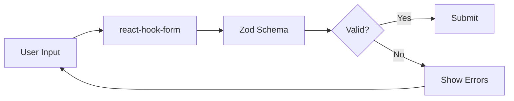

# Form Validation Consolidation

## Overview

This document details the standardization of form validation across the application using react-hook-form and Zod.

## Problem Statement

The application had:
- Mix of manual validation and react-hook-form
- No centralized validation schemas
- Duplicate validation logic across components
- Inconsistent error handling
- Missing type safety for forms
- Different approaches to displaying errors

## Solution

Created a centralized validation system with:
1. **Validation Schemas** (`/utils/validation/schemas.ts`)
   - Reusable Zod schemas
   - Consistent validation rules
   - Type-safe form interfaces

2. **Form Components** (`/utils/validation/components.tsx`)
   - Pre-configured form fields
   - Built-in validation display
   - Consistent UI patterns

## Architecture

### Validation Flow



### Schema Hierarchy

```typescript
// Base schemas (building blocks)
emailSchema
passwordSchema
titleSchema

// Composite schemas (complete forms)
signUpSchema = {
  email: emailSchema,
  password: passwordSchema,
  confirmPassword: string,
  agreeToTerms: boolean
}
```

## Usage Examples

### Basic Form with Validation

```typescript
import { useForm } from 'react-hook-form';
import { zodResolver } from '@hookform/resolvers/zod';
import { signInSchema, SignInForm } from '@/utils/validation';
import { EmailField, PasswordField, SubmitButton } from '@/utils/validation';

function SignInForm() {
  const form = useForm<SignInForm>({
    resolver: zodResolver(signInSchema),
    defaultValues: {
      email: '',
      password: '',
    },
  });

  const onSubmit = async (data: SignInForm) => {
    // Handle form submission
  };

  return (
    <Form {...form}>
      <form onSubmit={form.handleSubmit(onSubmit)} className="space-y-4">
        <EmailField
          control={form.control}
          name="email"
          label="Email"
        />
        
        <PasswordField
          control={form.control}
          name="password"
          label="Password"
        />
        
        <SubmitButton
          isSubmitting={form.formState.isSubmitting}
          label="Sign In"
        />
      </form>
    </Form>
  );
}
```

### Custom Validation with Translation

```typescript
import { createProjectSchema } from '@/utils/validation';
import { useTranslation } from 'react-i18next';

function CreateProjectForm() {
  const { t } = useTranslation();
  
  // Create translated schema
  const schema = createProjectSchema.extend({
    title: z.string()
      .min(1, t('validation.titleRequired'))
      .max(100, t('validation.titleTooLong')),
  });
  
  // Use schema with form...
}
```

### Async Validation

```typescript
import { createAsyncEmailSchema } from '@/utils/validation';

const checkEmailExists = async (email: string) => {
  const response = await apiClient.get(`/auth/check-email/${email}`);
  return response.data.exists;
};

const emailSchema = createAsyncEmailSchema(checkEmailExists);
```

## Available Schemas

### Authentication
- `signUpSchema` - User registration
- `signInSchema` - User login
- `forgotPasswordSchema` - Password reset request
- `resetPasswordSchema` - New password setting
- `changePasswordSchema` - Password change

### Projects
- `createProjectSchema` - New project creation
- `updateProjectSchema` - Project updates
- `shareProjectSchema` - Project sharing

### User
- `userProfileSchema` - Profile information
- `requestAccessSchema` - Access requests

## Validation Rules

```typescript
VALIDATION_RULES = {
  PASSWORD_MIN_LENGTH: 8,
  PASSWORD_MAX_LENGTH: 128,
  USERNAME_MIN_LENGTH: 3,
  USERNAME_MAX_LENGTH: 30,
  TITLE_MIN_LENGTH: 1,
  TITLE_MAX_LENGTH: 100,
  DESCRIPTION_MAX_LENGTH: 500,
  EMAIL_MAX_LENGTH: 254,
}
```

## Form Components

### Text Fields
```typescript
<TextField name="username" label="Username" />
<EmailField name="email" label="Email Address" />
<PasswordField name="password" label="Password" showStrength />
<TextareaField name="bio" label="Bio" rows={4} />
```

### Selection Fields
```typescript
<CheckboxField 
  name="agreeToTerms" 
  label="I agree to the terms" 
/>

<SelectField
  name="permission"
  label="Permission Level"
  options={[
    { value: 'view', label: 'View Only' },
    { value: 'edit', label: 'Edit' },
    { value: 'admin', label: 'Admin' },
  ]}
/>
```

### Form Utilities
```typescript
<FormErrorSummary errors={form.formState.errors} />
<SubmitButton isSubmitting={isLoading} />
```

## Migration Guide

### From Manual Validation

```typescript
// Old (manual validation)
const [email, setEmail] = useState('');
const [emailError, setEmailError] = useState('');

const validate = () => {
  if (!email) {
    setEmailError('Email is required');
    return false;
  }
  // More validation...
};

// New (with schemas)
const form = useForm({
  resolver: zodResolver(signInSchema),
});
```

### From Custom Components

```typescript
// Old
<input
  type="email"
  value={email}
  onChange={(e) => setEmail(e.target.value)}
  className={emailError ? 'error' : ''}
/>
{emailError && <span>{emailError}</span>}

// New
<EmailField
  control={form.control}
  name="email"
  label="Email"
/>
```

## Best Practices

### 1. Use Pre-built Schemas
```typescript
// Don't recreate common validations
import { emailSchema, passwordSchema } from '@/utils/validation';

const mySchema = z.object({
  email: emailSchema,
  password: passwordSchema,
});
```

### 2. Extend Schemas for Customization
```typescript
const customEmailSchema = emailSchema
  .refine(
    (email) => !email.endsWith('@example.com'),
    'Example emails are not allowed'
  );
```

### 3. Type-Safe Forms
```typescript
// Always use generated types
import { SignUpForm } from '@/utils/validation';

const form = useForm<SignUpForm>({
  resolver: zodResolver(signUpSchema),
});
```

### 4. Consistent Error Display
```typescript
// Use FormMessage component for errors
<FormField
  control={form.control}
  name="email"
  render={({ field }) => (
    <FormItem>
      <FormLabel>Email</FormLabel>
      <FormControl>
        <Input {...field} />
      </FormControl>
      <FormMessage /> {/* Automatic error display */}
    </FormItem>
  )}
/>
```

### 5. Password Strength Feedback
```typescript
<PasswordField
  control={form.control}
  name="password"
  label="Password"
  showStrength // Shows real-time strength indicator
/>
```

## Advanced Features

### Dynamic Schemas
```typescript
const createDynamicSchema = (minLength: number) => {
  return z.object({
    title: z.string().min(minLength),
  });
};
```

### Conditional Validation
```typescript
const schema = z.object({
  hasPhone: z.boolean(),
  phone: z.string().optional(),
}).refine(
  (data) => !data.hasPhone || data.phone,
  {
    message: 'Phone is required when hasPhone is true',
    path: ['phone'],
  }
);
```

### Cross-Field Validation
```typescript
const schema = z.object({
  startDate: z.date(),
  endDate: z.date(),
}).refine(
  (data) => data.endDate > data.startDate,
  {
    message: 'End date must be after start date',
    path: ['endDate'],
  }
);
```

## Benefits Achieved

1. **Type Safety**: Full TypeScript support for forms
2. **Consistency**: Same validation patterns everywhere
3. **Reusability**: Shared schemas reduce duplication
4. **User Experience**: Consistent error messages
5. **Developer Experience**: Less boilerplate code
6. **Maintainability**: Central location for validation rules

## Future Improvements

1. **Async Validation Cache**: Cache async validation results
2. **Field-Level Debouncing**: Configurable debounce for async validations
3. **Validation Presets**: Common validation combinations
4. **Error Message Templates**: Centralized error messages with i18n
5. **Form State Persistence**: Save form progress to localStorage