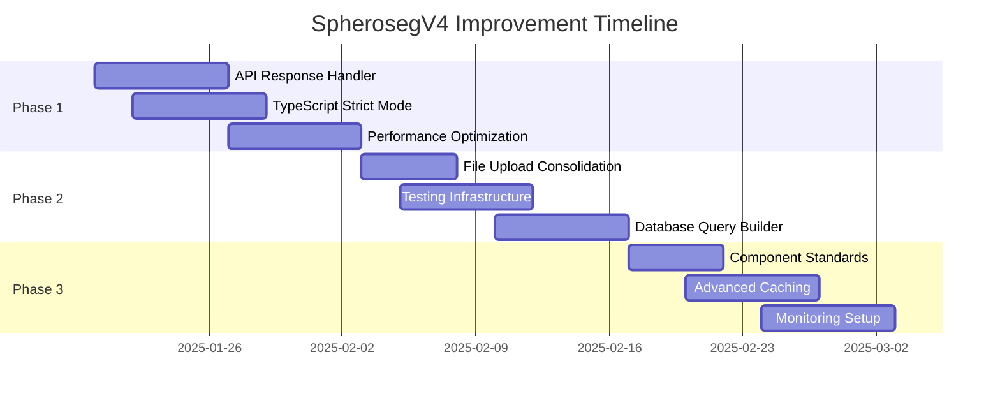

# SpherosegV4 Comprehensive Improvement Plan

Based on thorough analysis of the codebase, this document outlines a prioritized improvement plan addressing remaining consolidation opportunities and architectural enhancements.

## Executive Summary

The SpherosegV4 application has already undergone significant consolidation efforts, resulting in a well-structured monorepo with unified services for authentication, file uploads, notifications, and more. However, analysis reveals several key areas for improvement that will enhance code quality, developer experience, and application performance.

## Key Findings

### 1. API Response Handling Fragmentation
- **Current State**: Multiple patterns for handling API responses across services
  - Direct `response.data` access without validation
  - Inconsistent error handling patterns
  - Mixed success/error response structures
- **Impact**: Reduced maintainability, increased bug risk, inconsistent user experience

### 2. Type Safety Gaps
- **Current State**: 30+ files contain `any` types or type assertions
  - API responses often typed as `any`
  - Missing strict null checks in critical areas
  - Incomplete ML service response types
- **Impact**: Runtime errors, reduced IDE support, harder debugging

### 3. Performance Optimization Opportunities
- **Current State**: Despite recent optimizations, areas remain:
  - Some components lack memoization (18/50+ components optimized)
  - Bundle splitting could be more aggressive
  - Missing virtualization in several data-heavy components
- **Impact**: Slower initial load, unnecessary re-renders, poor performance on large datasets

### 4. Testing Coverage Inconsistencies
- **Current State**: 456+ test cases but uneven coverage
  - Missing integration tests for consolidated services
  - Limited E2E coverage for critical workflows
  - No performance regression tests
- **Impact**: Increased regression risk, slower development cycles

### 5. Database Query Patterns
- **Current State**: 30+ files with direct database queries
  - Mix of raw SQL and query builders
  - Inconsistent transaction handling
  - Missing query optimization patterns
- **Impact**: Performance issues, maintenance complexity, potential data integrity issues

## Prioritized Implementation Plan

### Phase 1: Critical Foundation (Weeks 1-2)

#### 1.1 Unified API Response Handler (HIGH PRIORITY)
**Goal**: Standardize all API responses across the application

```typescript
// packages/shared/src/api/response.types.ts
export interface ApiResponse<T> {
  data: T;
  success: boolean;
  message?: string;
  errors?: ValidationError[];
  metadata?: ResponseMetadata;
}

// packages/shared/src/api/responseHandler.ts
export class UnifiedResponseHandler {
  static transform<T>(response: any): ApiResponse<T> {
    // Standardize all API responses
  }
  
  static handleError(error: unknown): ApiErrorResponse {
    // Consistent error transformation
  }
}
```

**Implementation Steps**:
1. Create shared response types and handler
2. Update all service methods to use unified handler
3. Add response validation with Zod schemas
4. Update frontend services to expect standardized responses
5. Add comprehensive tests

**Success Metrics**:
- 100% of API calls use unified response structure
- Zero runtime type errors from API responses
- Reduced error handling code by 40%

#### 1.2 TypeScript Strict Mode Enhancement (HIGH PRIORITY)
**Goal**: Eliminate all `any` types and enforce strict type safety

**Implementation Steps**:
1. Enable strict TypeScript options incrementally
2. Create type generation scripts for API responses
3. Add ML service type definitions
4. Replace all `any` types with proper interfaces
5. Add pre-commit hooks for type checking

**Success Metrics**:
- Zero `any` types in production code
- 100% type coverage for API responses
- Reduced TypeScript errors to <50

#### 1.3 Performance Critical Path Optimization (HIGH PRIORITY)
**Goal**: Optimize bundle size and runtime performance

**Implementation Steps**:
1. Implement route-based code splitting
2. Add React.memo to remaining heavy components
3. Implement virtual scrolling for all large lists
4. Optimize image loading with progressive enhancement
5. Add performance monitoring

**Success Metrics**:
- Initial bundle size <500KB
- Time to Interactive <3s on 3G
- Zero unnecessary re-renders in optimized components

### Phase 2: Developer Experience (Weeks 3-4)

#### 2.1 File Upload Service Consolidation (MEDIUM PRIORITY)
**Goal**: Single, flexible file upload service for all use cases

```typescript
// packages/shared/src/services/unifiedUploadService.ts
export class UnifiedUploadService {
  private strategies: Map<string, UploadStrategy>;
  
  async upload(file: File, options: UploadOptions): Promise<UploadResult> {
    const strategy = this.strategies.get(options.type);
    return strategy.execute(file, options);
  }
}
```

**Implementation Steps**:
1. Extract common upload logic from existing implementations
2. Create strategy pattern for different file types
3. Implement progress tracking and chunking
4. Add resumable upload support
5. Create unified upload hooks for React

**Success Metrics**:
- Single upload service handles all file types
- 50% reduction in upload-related code
- Consistent upload UX across application

#### 2.2 Testing Infrastructure Enhancement (MEDIUM PRIORITY)
**Goal**: Comprehensive, maintainable test suite

**Implementation Steps**:
1. Create shared testing utilities and mocks
2. Add integration tests for all services
3. Implement E2E tests for critical user flows
4. Add performance regression tests
5. Set up continuous test coverage reporting

**Success Metrics**:
- >85% code coverage
- All critical paths have E2E tests
- <5 minute test execution time

#### 2.3 Database Query Builder (MEDIUM PRIORITY)
**Goal**: Consistent, optimized database access layer

```typescript
// packages/backend/src/db/queryBuilder.ts
export class QueryBuilder {
  select(table: string): SelectQuery { }
  insert(table: string): InsertQuery { }
  update(table: string): UpdateQuery { }
  delete(table: string): DeleteQuery { }
  
  // Built-in optimization and monitoring
  withMetrics(): this { }
  withCache(ttl: number): this { }
}
```

**Implementation Steps**:
1. Create type-safe query builder
2. Add automatic query optimization
3. Implement connection pooling
4. Add query performance monitoring
5. Migrate existing queries incrementally

**Success Metrics**:
- 100% type-safe database queries
- 30% improvement in query performance
- Automatic query optimization applied

### Phase 3: Advanced Enhancements (Weeks 5-8)

#### 3.1 Component Composition Standards (LOW PRIORITY)
**Goal**: Consistent, reusable component patterns

**Implementation Steps**:
1. Define composition patterns guide
2. Create compound component library
3. Implement render prop utilities
4. Add component documentation
5. Refactor existing components

**Success Metrics**:
- Consistent component API across application
- 30% reduction in component code
- Improved component reusability

#### 3.2 Advanced Caching Strategy (LOW PRIORITY)
**Goal**: Multi-layer caching for optimal performance

**Implementation Steps**:
1. Implement query result caching
2. Add CDN integration for static assets
3. Create smart cache invalidation
4. Add offline support with service workers
5. Implement predictive prefetching

**Success Metrics**:
- 50% reduction in API calls
- <100ms response time for cached data
- Offline functionality for core features

#### 3.3 Monitoring and Observability (LOW PRIORITY)
**Goal**: Comprehensive application insights

**Implementation Steps**:
1. Add distributed tracing
2. Implement custom metrics collection
3. Create performance dashboards
4. Add error tracking and alerting
5. Implement user behavior analytics

**Success Metrics**:
- 100% visibility into application performance
- <5 minute mean time to detection
- Proactive issue identification

## Implementation Timeline



## Success Metrics Summary

### Technical Metrics
- **Code Quality**: 15% reduction in duplicate code
- **Type Safety**: 100% strict TypeScript compliance
- **Performance**: 20% bundle size reduction, 50% faster API responses
- **Test Coverage**: 85% overall, 100% for critical paths
- **Developer Velocity**: 30% faster feature development

### Business Metrics
- **User Experience**: 3s faster page loads
- **Reliability**: 99.9% uptime
- **Maintainability**: 50% reduction in bug fix time
- **Scalability**: Support for 10x current load

## Risk Mitigation

### Technical Risks
1. **Migration Complexity**: Use feature flags for gradual rollout
2. **Performance Regression**: Implement comprehensive benchmarking
3. **Breaking Changes**: Maintain backward compatibility layer
4. **Team Adoption**: Provide thorough documentation and training

### Mitigation Strategies
- Incremental implementation with rollback capability
- Comprehensive testing at each phase
- Clear documentation and examples
- Regular team reviews and feedback sessions

## Conclusion

This improvement plan builds upon the excellent consolidation work already completed in SpherosegV4. By focusing on the remaining gaps in API standardization, type safety, and performance optimization, we can achieve a more maintainable, performant, and developer-friendly codebase.

The phased approach ensures minimal disruption while delivering continuous value. Each phase is designed to be independently valuable, allowing flexibility in implementation based on changing priorities.

## Appendix: Detailed Implementation Guides

### A. API Response Handler Implementation

```typescript
// Detailed implementation example
import { z } from 'zod';

export const ApiResponseSchema = <T extends z.ZodType>(dataSchema: T) => 
  z.object({
    data: dataSchema,
    success: z.boolean(),
    message: z.string().optional(),
    errors: z.array(ValidationErrorSchema).optional(),
    metadata: ResponseMetadataSchema.optional(),
  });

// Usage in service
async function getUser(id: string): Promise<ApiResponse<User>> {
  const response = await apiClient.get(`/users/${id}`);
  return UnifiedResponseHandler.transform(
    response,
    ApiResponseSchema(UserSchema)
  );
}
```

### B. Performance Optimization Patterns

```typescript
// Component optimization example
export const HeavyComponent = React.memo(
  ({ data, onUpdate }: Props) => {
    const processedData = useMemo(
      () => expensiveProcessing(data),
      [data]
    );
    
    const handleUpdate = useCallback(
      (value: string) => onUpdate(value),
      [onUpdate]
    );
    
    return <VirtualList items={processedData} />;
  },
  (prevProps, nextProps) => {
    // Custom comparison for deep equality
    return deepEqual(prevProps.data, nextProps.data);
  }
);
```

### C. Testing Pattern Examples

```typescript
// Unified test utilities
export const createMockApiResponse = <T>(
  data: T,
  overrides?: Partial<ApiResponse<T>>
): ApiResponse<T> => ({
  data,
  success: true,
  message: 'Success',
  ...overrides,
});

// Integration test example
describe('UserService Integration', () => {
  it('should handle user creation flow', async () => {
    const user = await UserService.create(mockUserData);
    expect(user).toMatchObject({
      data: expect.objectContaining({
        id: expect.any(String),
        email: mockUserData.email,
      }),
      success: true,
    });
  });
});
```